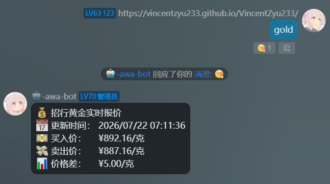
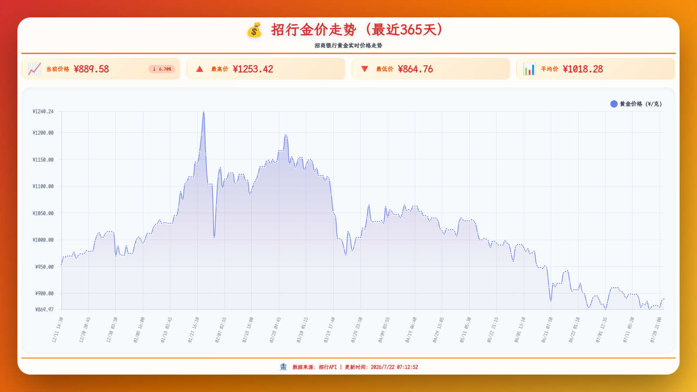

# 💰 koishi-plugin-gold-price-image

[](https://www.npmjs.com/package/koishi-plugin-gold-price-image)
[](https://npm-stat.com/charts.html?package=koishi-plugin-gold-price-image)

[](https://github.com/VincentZyuApps/koishi-plugin-gold-price-image)
[](https://gitee.com/vincent-zyu/koishi-plugin-gold-price-image)

[](https://forum.koishi.xyz/t/topic/xxxxx)
[](https://qm.qq.com/q/ZN7fxZ3qCq)

<h2>💬 交流反馈</h2>
<p>🐛 Bug 反馈 / 💡 建议 / 👨‍💻 插件开发交流，欢迎加群：</p>
<p><del>💬 插件使用问题 / 🐛 Bug反馈 / 👨‍💻 插件开发交流，欢迎加入QQ群：<b>259248174</b> 🎉（这个群G了）</del></p>
<p>💬 插件使用问题 / 🐛 Bug反馈 / 👨‍💻 插件开发交流，欢迎加入QQ群：<b>1085190201</b> 🎉</p>
<p>💡 在群里直接艾特我，回复的更快哦~ ✨</p>

📈 招行金价走势图 Koishi 插件

## ⚠️ 重要提示

**本插件需要启用 `puppeteer`、`http` 和 `database` 服务才能正常使用！**

请确保在 Koishi 控制台中已经安装并启用了以下插件：
- `puppeteer` - 用于渲染图表
- `http` - 用于网络请求
- `database` - 用于存储历史数据
- `cron` - 可选，仅在采集模式选择 `cron` 时需要

如果没有安装前三项必需服务，本插件将无法工作。默认 `simple` 采集模式不需要 cron 服务。

---

## 🚀 功能介绍

- **定时抓取** - 自动从招行 API 抓取实时金价数据
- **好看图表** - 使用 Chart.js 渲染专业的金价走势图
- **数据存储** - 自动存储历史数据到数据库
- **自定义范围** - 支持查看不同时间范围的金价走势
- **统计信息** - 自动计算最高价、最低价、平均价

## 📝 注意事项

- 插件会在下一个符合抓取间隔的整数分钟开始采集
- 数据会自动存储到数据库，不会丢失
- 首次使用需要等待数据采集
- 定时任务会在插件卸载时自动停止

---

## 📖 使用方法

### 基础命令

```
gold              # 获取当前招行金价（中文别名：当前金价）
gold-image        # 查看最近 24 小时金价走势（中文别名：金价走势）
```

### 指定时间范围

```
gold-image 30 m          # 查看最近 30 分钟
gold-image 45 minutes    # 查看最近 45 分钟
gold-image 90 分钟       # 查看最近 90 分钟
gold-image 6 h           # 查看最近 6 小时
gold-image 12 hours      # 查看最近 12 小时
gold-image 3 小时        # 查看最近 3 小时
gold-image 1 day         # 查看最近 1 天
gold-image 7 d           # 查看最近 7 天
gold-image 30 天         # 查看最近 30 天
```

---

### 效果预览

#### 实时金价



#### 金价走势



---

## ⚙️ 配置说明

### 基础配置

| 配置项 | 类型 | 默认值 | 说明 |
| --- | --- | --- | --- |
| `textCommandName` | `string` | `gold` | 实时金价查询命令名称 |
| `textCommandAliases` | `string[]` | `当前金价`、`gold-current-price`、`gcp`、`goldprice` | 实时金价查询命令别名 |
| `imageCommandName` | `string` | `gold-image` | 金价走势图命令名称 |
| `imageCommandAliases` | `string[]` | `金价走势`、`gold-trend-image`、`gti`、`goldtrend` | 金价走势图命令别名 |
| `fetchScheduleMode` | `simple \| cron` | `simple` | 金价定时采集模式 |
| `fetchIntervalMinutes` | `number` | `5` | `simple` 模式的抓取间隔，可设置为 1-1440 分钟 |
| `fetchCronExpression` | `string` | `*/5 * * * *` | `cron` 模式的五段式 Cron 表达式，当前为实验性配置 |

选择 `cron` 模式时需要安装并启用 [`koishi-plugin-cron`](https://www.npmjs.com/package/koishi-plugin-cron)。cron 服务缺失或表达式无效时会记录明确错误，不会回退到简单模式。两种模式都会在上一轮采集未完成时跳过新任务，避免并发请求和重复写入。

### API 配置

| 配置项 | 类型 | 默认值 | 说明 |
| --- | --- | --- | --- |
| `apiUrl` | `string` | `https://mbmodule-openapi.paas.cmbchina.com/product/v1/func/market-center` | 招行金价 API 地址 |
| `apiHeaders` | `{ key, value }[]` | 内置招行请求头 | API 请求头表格 |
| `apiPayload` | `string` | `params=[{"prdType":"H","prdCode":""}]` | API 请求参数 |

### 默认时间范围

| 配置项 | 类型 | 默认值 | 说明 |
| --- | --- | --- | --- |
| `defaultNum` | `number` | `24` | 走势图命令未传入时间数量时使用 |
| `defaultUnit` | `m \| h \| d` | `h` | 默认时间单位，分别表示分钟、小时和天 |

### 图表配置

| 配置项 | 类型 | 默认值 | 说明 |
| --- | --- | --- | --- |
| `chartWidth` | `number` | `1600` | 图表宽度（像素） |
| `chartHeight` | `number` | `900` | 图表高度（像素） |
| `maxDataPoints` | `number` | `144` | 数据采样后的最大点数，可设置为 10-114514 |
| `maxXAxisTicks` | `number` | `24` | X 轴最大时间标签数，可设置为 5-200 |
| `maxYAxisTicks` | `number` | `9` | Y 轴最大金价标签数，可设置为 3-20 |
| `imageType` | `png \| jpeg \| webp` | `png` | 图片输出格式 |
| `imageQuality` | `number` | `90` | JPEG 和 WebP 图片质量，可设置为 0-100 |

### 字体与运行资产配置

| 配置项 | 类型 | 默认值 | 说明 |
| --- | --- | --- | --- |
| `fontMode` | `system \| lxgw \| custom` | `lxgw` | 严格使用所选字体模式，不会自动回退 |
| `customFontPath` | `string` | 空字符串 | 自定义字体绝对路径，仅在 `custom` 模式使用 |
| `fontAssetPathRelativeToBaseDir` | `string[]` | `data / fonts / LXGWWenKaiMono-Regular.ttf` | 禁用的只读数组，展示相对于 `ctx.baseDir` 的共享字体路径 |
| `chartJsAssetPathRelativeToBaseDir` | `string[]` | `data / assets / gold-price-image / chart.umd.min.js` | 禁用的只读数组，展示相对于 `ctx.baseDir` 的 Chart.js 运行路径 |

#### 字体配置备注
> 字体模式严格执行，不会自动回退到其他模式。
>
> - `system` 直接使用浏览器系统字体，不检查或下载字体文件。
> - `lxgw` 使用共享的 `ctx.baseDir/data/fonts/LXGWWenKaiMono-Regular.ttf`；文件缺失时先从 [Gitee Release](https://gitee.com/vincent-zyu/koishi-plugin-awa-quote-image/releases/tag/fonts) 下载，失败后尝试 [GitHub Release](https://github.com/VincentZyuApps/koishi-plugin-awa-quote-image/releases/tag/fonts)。下载结果会校验文件大小和 SHA-256，校验通过后才会原子替换正式字体文件。
> - `custom` 严格使用 `customFontPath` 指定的绝对路径，支持 TTF、OTF、WOFF 和 WOFF2。
>
> 所选字体缺失、路径无效、下载失败、校验失败或浏览器加载失败时，当前出图命令会直接报错。

#### Chart.js 运行资产备注

> 插件启动与渲染前会把内置 `assets/chart.umd.min.js` 同步到 `ctx.baseDir/data/assets/gold-price-image/chart.umd.min.js`。运行副本缺失或 SHA-256 与内置版本不一致时会自动原子恢复。
>
> 如果运行目录无法创建或复制失败，插件会临时使用包内 `assets/chart.umd.min.js` 保证出图，并在日志中明确提示该 fallback 会继续占用 `external` 或 `node_modules` 中的插件文件。
>
> 托管字体和 Chart.js 运行资产均直接相对于 `ctx.baseDir` 定位，不使用 `process.cwd()`。

### 调试配置

| 配置项 | 类型 | 默认值 | 说明 |
| --- | --- | --- | --- |
| `verboseSessionOutput` | `boolean` | `false` | 在会话中输出详细调试信息 |
| `verboseConsoleOutput` | `boolean` | `true` | 在控制台输出详细调试信息 |
